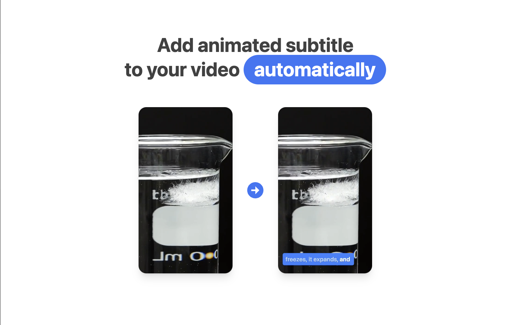

<br />
<p align="center">
  <a href="https://github.com/zernonia/vista">
    
  </a>
  <br />

  <p align="center">
    Automatic, Animated subtitle generation for<br> short-form video! 
  </p>

  <p align="center"> 
    <a href="https://www.vistaeditor.com/">View Demo</a>
    ·
    <a href="https://github.com/zernonia/vista/issues">Report Bug</a>
    ·
    <a href="https://github.com/zernonia/vista/issues">Request Feature</a>
  </p>
</p>

<br/>



## Story

Vista is my Hackathon submission for [Supabase Launch week 6](https://supabase.com/launch-week). It was inspired by those animated subtitle while scrolling through Youtube Shorts, and I always wanted to play with [ffmpeg](https://ffmpeg.org/), and this serves as a good opportunity!

This ends up a super challenging task:

1. I need to run ffmpeg for video encoding, but hosting a server will required alot of coding & maintainance, thus resorting to use ffmpeg-wasm, which could be use on modern browser that supports wasm.

2. Perform speech-to-text is not an easy task, to speed up MVP, I've utilized AssemblyAI API for the video transcription.

3. Because speech-to-text is an async task, I've combined [Supabase Edge Function](https://github.com/zernonia/vista/tree/main/supabase/functions/transcribe-webhook) as webhook when the process is done, then use [Supabase Realtime](https://github.com/zernonia/vista/blob/main/pages/v/%5Bid%5D.vue#L8) to populate the subtitle.

## Supabase Usage

1. Supabase Auth - to handle user and their storage bucket
2. Supabase DB - to store projects data
3. Supabase Storage - to store user's video (with policies)
4. Supabase Realtime - to populate the UI anytime when subtitle is ready
5. Supabase Edge Function - trigger AssemblyAI transcription, and act as webhook

## 🚀 Features

- 🤩 Free
- 📖 Open-Source

### 🔨 Built With

- [Nuxt 3](https://v3.nuxtjs.org/)
- [Supabase](https://supabase.com)
- [UnoCss](https://uno.antfu.me/)
- [AssemblyAI](https://www.assemblyai.com/)
- [FFmpeg.wasm](https://ffmpegwasm.netlify.app/)

## 🌎 Setup

### Prerequisites

Yarn

- ```sh
  npm install --global yarn
  ```

### Development

1. Clone the repo
   ```sh
   git clone https://github.com/zernonia/vista.git
   ```
2. Install NPM packages
   ```sh
   cd vista
   yarn install
   ```
3. Set up `.env` (check `.env.example`)
4. Run local development instance
   ```sh
   yarn dev
   ```

### Supabase Database

```sql
create table users (
  id uuid default uuid_generate_v4() primary key,
  updated_at timestamp default now(),
  username text,
  full_name text,
  avatar_url text
);

create table projects (
  id uuid default uuid_generate_v4() primary key,
  user_id uuid references users (id),
  created_at timestamp default now(),
  video_key text,
  transcription_id text,
  words ARRAY,
  title text,
  config json
);


create or replace function public.handle_new_user()
  returns trigger as $$
  begin
    insert into public.users (id, avatar_url, username)
    values (new.id, new.raw_user_meta_data->>'avatar_url', new.raw_user_meta_data->>'user_name';
    return new;
  end;
  $$ language plpgsql security definer;


create trigger on_auth_user_created
  after insert on auth.users
  for each row execute procedure public.handle_new_user();
```

## ➕ Contributing

Contributions are what make the open source community such an amazing place to be learn, inspire, and create. Any contributions you make are **greatly appreciated**.

1. Fork the Project
2. Create your Feature Branch (`git checkout -b feature/AmazingFeature`)
3. Commit your Changes (`git commit -m 'Add some AmazingFeature'`)
4. Push to the Branch (`git push origin feature/AmazingFeature`)
5. Open a Pull Request

## Acknowledgement

1. [Nuxt 3 - Awesome framework](https://v3.nuxtjs.org/)
1. [Supabase - Super easy setup (as always)](https://supabase.com)

## Author

- Zernonia ([@zernonia](https://twitter.com/zernonia))

Also, if you like my work, please buy me a coffee ☕😳

<a href="https://www.buymeacoffee.com/zernonia" target="_blank">
    
  </a>

## 🔥 Contributors

<a href="https://github.com/zernonia/vista/graphs/contributors">
  
</a>

## 📜 License

Distributed under the MIT License. See `LICENSE` for more information.
